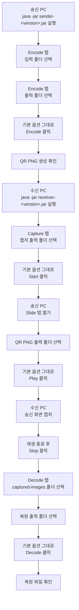

# GUI 사용자 매뉴얼

`air-bridge`를 GUI로 사용하는 사람을 위한 문서 모음입니다.

기본 흐름은 아래 4단계입니다.

1. 송신 PC에서 파일을 QR 이미지로 만든다.
2. 수신 PC에서 카메라나 캡처 장치로 QR 이미지를 저장 준비한다.
3. 송신 PC에서 QR 이미지를 화면에 재생한다.
4. 수신 PC에서 저장된 QR 이미지를 원본 파일로 복원한다.

처음 사용할 때는 기본 옵션을 바꾸지 않습니다. 폴더만 선택하고 버튼만 누르는
방식으로 전체 흐름을 먼저 확인합니다.

처음 사용하는 경우 아래 순서대로 보면 됩니다.

- `deploy-sender.md`
- `deploy-receiver.md`
- `encode-decode.md`
- `slide-capture.md`
- `tuning.md`
- `warning.ko.md`

일반 사용자는 먼저 `encode-decode.md`와 `slide-capture.md`만 보면 됩니다.
