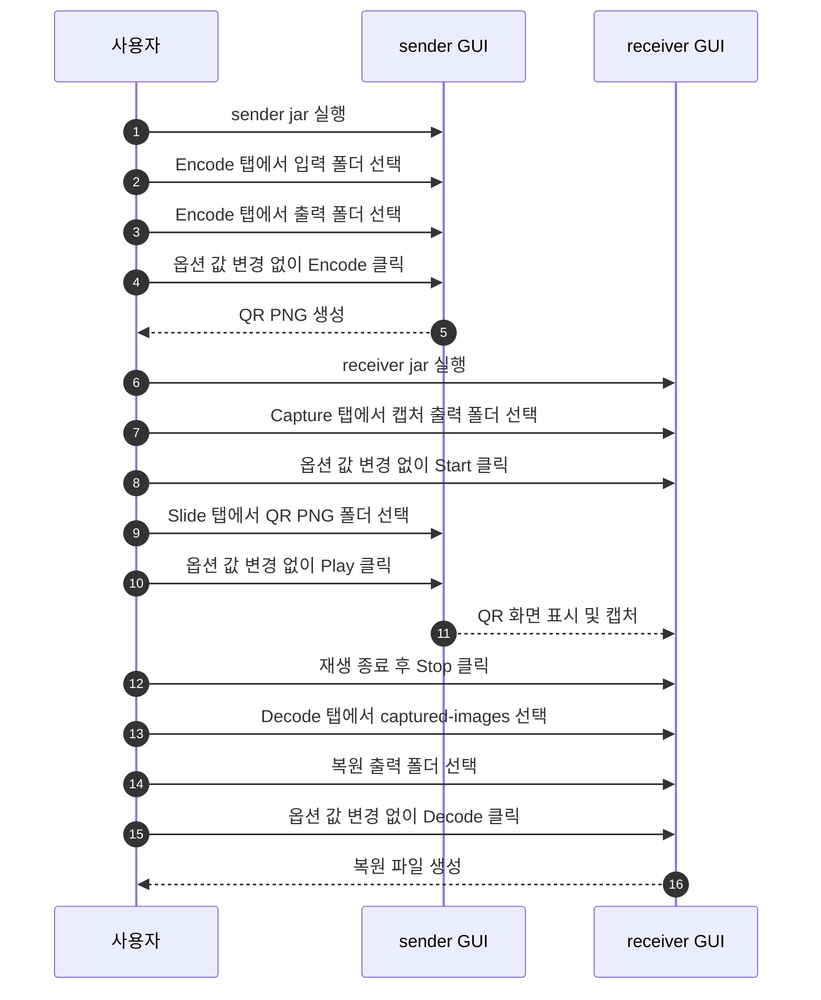

# Encode / Decode GUI 사용법

이 문서는 GUI에서 파일을 QR 이미지로 만들고, 다시 원본 파일로 복원하는 방법을
정리합니다.

## 전체 흐름

일반적인 파일 전송은 아래 순서입니다. 처음에는 기본 옵션을 바꾸지 않고
폴더만 선택해서 진행합니다.

1. 송신 PC의 sender GUI에서 `Encode`를 실행한다.
2. 수신 PC의 receiver GUI에서 `Capture`를 시작해 저장 준비를 한다.
3. 송신 PC의 sender GUI에서 만들어진 QR PNG를 `Slide`로 재생한다.
4. receiver GUI의 `Decode`로 원본 파일을 복원한다.



## 준비물

- 송신 PC: `sender-<version>.jar`
- 수신 PC: `receiver-<version>.jar`
- 보낼 파일이 들어 있는 폴더
- QR PNG를 저장할 폴더
- 복원 결과를 저장할 폴더

## 1. 송신 PC에서 Encode

sender GUI를 엽니다.

```bash
java -jar sender-<version>.jar
```

`Encode` 탭에서 아래 순서로 진행합니다.

1. 입력 폴더를 선택합니다.
2. 출력 폴더를 선택합니다.
3. 나머지 옵션은 기본값 그대로 둡니다.
4. `Encode`를 누릅니다.

완료되면 출력 폴더에 QR PNG 파일이 생성됩니다.

같은 GUI의 `Slide` 탭에서 슬라이드 입력 폴더를 직접 고를 수 있습니다. `Encode`
탭의 `Slide` 버튼은 출력 폴더가 입력되어 있으면 그 폴더를 바로 슬라이드
입력으로 엽니다.

실행 중에는 결과가 중간에 다른 설정과 섞이지 않도록 `Encode` 탭의 입력값이
잠깁니다. 중단이 필요하면 `Stop`을 누릅니다. `Stop`으로 중단되면 이번 실행에서
생성한 출력 파일은 정리되고, 기존 파일이나 비어 있지 않은 폴더는 유지됩니다.

Browse 선택창은 macOS에서는 Finder 스타일 창을 사용하고, Windows에서는
native Explorer 스타일 창을 우선 시도한 뒤 필요하면 Swing 디렉터리 선택창으로
내려갑니다. 입력칸 경로가 유효하면 그 위치에서 시작하고, 비어 있거나
유효하지 않으면 앱을 시작한 위치에서 시작합니다.

## Encode 결과 확인

- QR PNG 파일들이 생성되었는지 확인합니다.

## 변환 옵션은 언제 쓰나

처음 전송에서는 사용하지 않습니다. 기본 옵션으로 전체 흐름이 성공한 뒤, 업무상
파일 형식을 바꿔야 할 때만 검토합니다.

- XLSX를 CSV로 바꿔 인코딩
- DOCX/PPTX를 텍스트로 바꿔 인코딩
- 특정 확장자만 대상에 포함
- 폴더 구조 유지 여부 변경
- 출력 폴더를 일정 개수 단위로 나누기

주의할 점:

- `.xlsx`는 변환 옵션을 켜지 않으면 원본 그대로 인코딩됩니다.
- `.xls`는 자동 CSV 변환을 지원하지 않습니다.
- 변환 옵션을 켜면 복원 결과 파일 확장자도 변환된 형식 기준으로 나옵니다.

## Encode 탭의 추가 입력값 (몰라도 됨)

`Encode` 탭에는 아래 두 칸이 더 있습니다. 처음에는 **기본값 그대로** 두면 됩니다.

- `Repair overhead`(복구 여유분): 카메라가 QR을 일부 놓쳐도 복원되도록 **여분의 QR을 함께
  만드는 비율**입니다. 기본값은 `0.5`입니다. 올리면 손실에 강해지지만 QR 장수가 늘어
  재생 시간이 길어지고, 내리면 빨라지지만 놓쳤을 때 복원에 실패하기 쉽습니다. 캡처 환경이
  깨끗하면 낮춰도(예: `0.2`) 되고, 불안정하면 올립니다(예: `1.0`).
- `Encode workers`(인코딩 병렬 수): QR 생성을 몇 개의 스레드로 동시에 처리할지입니다. 보통
  기본값으로 충분하며, 인코딩이 느릴 때만 올립니다.

## 2. 수신 PC에서 Capture 준비

receiver GUI를 엽니다.

```bash
java -jar receiver-<version>.jar
```

`Capture` 탭에서 캡처 출력 폴더를 선택합니다. 장치 번호, 해상도, FPS, Preview
관련 값은 기본값 그대로 둡니다.

송신 PC의 슬라이드 화면이 보이도록 카메라나 캡처 장치를 맞춘 뒤 `Start`를
누릅니다. 이 상태가 QR 이미지를 저장할 준비가 끝난 상태입니다.

## 3. 송신 PC에서 Slide 재생

sender GUI의 `Slide` 탭에서 QR PNG 출력 폴더를 선택합니다. `Page(ms)`,
`Black(ms)`, `Loop`는 기본값 그대로 둡니다.

수신 PC에서 `Capture`가 시작된 것을 확인한 뒤 `Play`를 누릅니다. 재생이 끝나면
수신 PC에서 `Stop`을 누르고, 캡처 출력 폴더 아래 `captured-images` 폴더가
생겼는지 확인합니다.

## 4. 수신 PC에서 Decode

같은 receiver GUI의 `Decode` 탭에서 아래 순서로 진행합니다.

1. QR PNG 입력 폴더를 선택합니다.
2. 복원 결과를 저장할 출력 폴더를 선택합니다.
3. 나머지 옵션은 기본값 그대로 둡니다.
4. `Decode`를 누릅니다.

캡처를 통해 받은 이미지라면 입력 폴더는 보통 `captured-images`입니다.

복원이 실행되는 동안에는 `Decode` 탭의 입력값을 바꿀 수 없습니다.

복원에 사용된 QR PNG는 입력 폴더 옆의 `*-success` 디렉터리로 이동될 수 있습니다.

예:

- `batch/0001.png` 성공 후 `batch-success/0001.png`

## Decode 결과 확인

복원 출력 폴더에 원본 파일이 생겼는지 확인합니다. 문제가 있으면 GUI에 표시되는
상태 메시지를 먼저 확인합니다.

자주 보는 상태:

- 복원 성공: 출력 폴더에 원본 파일이 생깁니다.
- **복원 실패(심볼 부족)**: QR을 충분히 못 받았다는 뜻입니다. 특정 한 장이 빠진 게 아니라
  **개수**가 모자란 것이므로, 같은 화면을 한 번 더 재생·캡처하거나 다음 전송에서 `Encode` 탭의
  `Repair overhead`를 올려 여분 QR을 늘리면 됩니다.

## 전체 점검

처음에는 작은 파일 1개로 전체 흐름을 검증합니다.

- sender GUI가 열리는지 확인
- `Encode` 완료 후 QR PNG 생성 확인
- receiver GUI의 `Capture`를 먼저 시작할 수 있는지 확인
- `Slide`로 QR 이미지가 재생되고 캡처되는지 확인
- `Decode` 완료 후 복원 출력 폴더에 원본 파일이 생겼는지 확인

## 관련 문서

- `deploy-sender.md`
- `deploy-receiver.md`
- `slide-capture.md`
- `warning.ko.md`
