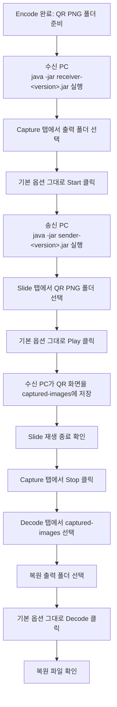

# Capture 준비 / Slide 재생 GUI 사용법

이 문서는 수신 PC에서 캡처를 먼저 준비한 뒤, 송신 PC에서 QR 이미지를 재생하는
방법을 정리합니다.

## 언제 쓰나

`Encode`로 만든 QR PNG 세트를 송신 PC 화면에 재생하고, 수신 PC에서 카메라나
캡처 장치로 받아 저장할 때 사용합니다.

일반적인 흐름:

1. 송신 PC에서 `Encode` 실행
2. 수신 PC에서 `Capture` 실행
3. 송신 PC에서 `Slide` 실행
4. 수신 PC에서 `Decode` 실행

`Slide`와 `Capture`는 파일을 직접 복원하지 않습니다. 화면 재생과 이미지 저장을
담당하는 중간 전송 단계입니다.

처음 사용할 때는 `Page(ms)`, `Black(ms)`, `Loop`, `FPS`, `Preview FPS` 값을
바꾸지 않습니다. 폴더만 선택하고 `Start`, `Play`, `Stop` 순서만 맞춥니다.



## 준비물

- 송신 PC:
  - `sender-<version>.jar`
  - `encode` 결과 QR PNG 디렉터리
- 수신 PC:
  - `receiver-<version>.jar`
  - 카메라 또는 capture board
  - 캡처 결과를 저장할 디렉터리

## 1. 수신 PC: Capture 준비

receiver GUI를 엽니다.

```bash
java -jar receiver-<version>.jar
```

`Capture` 탭에서 아래 순서로 진행합니다.

1. 출력 폴더를 선택합니다.
2. 장치 번호, 해상도, FPS는 기본값 그대로 둡니다.
3. `Preview`와 `Preview FPS`도 기본값 그대로 둡니다.
4. 송신 PC의 슬라이드 화면이 보이도록 카메라나 캡처 장치를 맞춥니다.
5. `Start`를 누릅니다.

GUI에서는 `duration`, `max payloads`, `same signal` 값을 직접 입력하지 않고
내부 기본값을 사용합니다. 캡처가 실행되는 동안에는 Capture 탭의 입력값이
잠기고 `Decode` 버튼도 비활성화됩니다. `Preview`와 `Preview FPS`는 캡처
실행 중에도 바꿀 수 있으며, GUI 미리보기 갱신 빈도에만 영향을 줍니다.

## 2. 송신 PC: Slide 재생

sender GUI를 엽니다.

```bash
java -jar sender-<version>.jar
```

`Slide` 탭에서 아래 순서로 진행합니다.

1. `Browse`로 QR PNG가 들어 있는 폴더를 선택합니다.
2. `Page(ms)`, `Black(ms)`, `Loop`는 기본값 그대로 둡니다.
3. 수신 PC에서 `Capture`가 시작된 것을 확인합니다.
4. `Play`로 재생을 시작합니다.
5. 재생이 끝나면 수신 PC에서 `Stop`을 누릅니다.

입력 규칙:

- 선택한 폴더 아래의 `.png`, `.jpg`, `.jpeg`를 재귀적으로 읽습니다.
- `session-start`가 포함된 파일은 먼저, `session-end`가 포함된 파일은 마지막에 배치됩니다.
- 나머지는 상대 경로 기준으로 정렬됩니다.

Browse 선택창은 macOS에서는 Finder 스타일 창을 사용하고, Windows에서는
native Explorer 스타일 창을 우선 시도한 뒤 필요하면 Swing 디렉터리 선택창으로
내려갑니다. 입력칸 경로가 유효하면 그 위치에서 시작하고, 비어 있거나
유효하지 않으면 앱을 시작한 위치에서 시작합니다.

주요 UI:

- `Browse`: 입력 디렉터리 선택
- `Reload`: 이미지 다시 읽기
- `Page(ms)`: 한 장 표시 시간
- `Black(ms)`: 페이지 사이 검은 화면 시간
- `Loop`: 반복 횟수
- `Full Screen`
- `Always On Top`
- `Play` / `Pause`

처음 권장값:

- `Page(ms)`: `100`
- `Black(ms)`: `50`
- `Loop`: `1`
- `Full Screen`: 기본 켜짐
- `Always On Top`: 기본 켜짐

자주 쓰는 단축키:

- `Space`: 재생 / 일시정지
- `Left` / `Right`: 이전 / 다음
- `Page Up` / `Page Down`: 100장 이동
- `F`: 전체화면 토글
- `T`: 패널 토글
- `Q`: 종료

캡처가 끝나면 출력 폴더 아래 `captured-images` 폴더를 확인합니다.

주요 산출물:

- `captured-images/frame_000001.png`
- `captured-images/frame_000002.png`

장치가 잡히지 않으면 연결 상태와 운영체제의 카메라 권한을 확인합니다.

## 3. Capture 후 Decode

캡처가 끝나면 같은 receiver GUI의 `Decode` 탭에서 복원합니다.

1. QR PNG 입력 폴더로 `captured-images`를 선택합니다.
2. 복원 출력 폴더를 선택합니다.
3. `Decode`를 누릅니다.
4. 복원 출력 폴더에 원본 파일이 생겼는지 확인합니다.

Decode 탭에서 복원을 실행하는 동안에는 QR PNG 입력 폴더, 복원 출력 폴더,
`Browse`, `Decode` 버튼이 잠깁니다.

## 권장 설정

처음에는 화면에 표시된 기본값을 그대로 사용합니다. 아래 값은 기본 사용 흐름에서
변경하지 않는 기준값입니다.

`Slide`:

- `Page(ms)`: `100`
- `Black(ms)`: `50`
- `Loop`: `1`

`Capture`:

- `FPS`: `15`
- `Preview`: 필요할 때만 켬
- `Preview FPS`: 화면 확인에 필요한 만큼만 사용

속도 조정은 기본값으로 전송에 성공한 뒤에만 검토합니다. 기본 사용자 흐름에서는
값을 바꾸지 않습니다.

### 다음 전송에 쓸 권장 속도

`Capture` 실행 중 로그 영역에는 **약 10초마다** 지금까지 받아낸 속도와 함께 **다음 전송 때 쓰면 좋은
`Page(ms)` 권장값**이 표시되고(`Stop` 시에도 한 번 더), 캡처가 진행될수록 값이 갱신됩니다
(예: `고유 12.3 QR/s -> slide page-display-ms >= 90ms 권장`). 수신 측이 송신 측에 직접 신호를
보내지는 못하므로 이 값은 강제 설정이 아니라 **가이드**입니다. 다음에 송신 PC의 `Slide` 탭에서
`Page(ms)`를 이 값 이상으로 잡는 기준으로 쓰면 됩니다. 놓친 QR이 많았다면 값이 커지고, 여유가
있었다면 작아집니다.

`Slide`의 `Page(ms)`는 최소 `20`, `Black(ms)`는 최소 `1`까지 내릴 수 있습니다. 빠르게 내릴수록
놓칠 확률이 올라가므로 `Decode` 결과(복원 실패 여부)를 보며 한계를 찾고, 위 권장값을 기준으로
잡으면 됩니다.

## 결과 확인

복원 출력 폴더에 원본 파일이 생겼는지 확인해야 실제 전송 성공 여부를 판단할 수
있습니다.

## 운영 팁

- `Slide`는 전체화면과 전면 유지가 기본이라 다른 작업과 병행하기 어렵습니다.
- 처음에는 송신 화면과 수신 카메라의 해상도, 화면 비율을 안정적으로 맞춥니다.
- 속도 값을 조정한 경우에는 반드시 `Decode` 결과까지 확인합니다.
- 캡처 중 미리보기가 부담되면 `Preview`를 끄거나 `Preview FPS`를 낮춥니다.
- 장치 이름이나 번호가 애매하면 연결된 장치와 운영체제 권한을 먼저 확인합니다.

## 관련 문서

- `encode-decode.md`
- `deploy-sender.md`
- `deploy-receiver.md`
